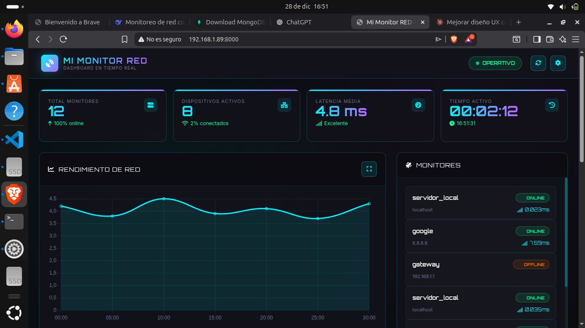

# Mi Monitor RED

Pequeña estructura inicial para un monitor de red.

Estructura:

- src/: código fuente
  - src/main.py: Punto de entrada
  - src/base_de_datos/: gestión de MongoDB
  - src/monitores/: lógica de escaneo y checks
  - src/utilidades/: utilidades compartidas
- configuracion/: archivos de configuración
- registros/: logs del sistema
- datos/: datos locales / backups
- requirements.txt: dependencias

Instalación (virtualenv recomendado):

```bash
python3 -m venv .venv
source .venv/bin/activate
pip install -r requirements.txt
```

Ejecución rápida:

```bash
python3 src/main.py
```

Logs:

- Archivo: `registros/app.log`

Siguientes pasos sugeridos:

- Implementar conexión a MongoDB en `src/base_de_datos`
- Añadir detectores y comprobaciones en `src/monitores`
- Añadir configuración en `configuracion/` (p. ej. YAML / .env)

Si quieres, puedo añadir ejemplos de configuración, un `docker-compose.yml` o pruebas unitarias.   

Interfaz web (UI estática)
-------------------------

Se incluye una UI estática mínima en `src/ui/static/` y un servidor muy simple en `src/ui/run_ui.py`.

Para servir la UI localmente:

```bash
python3 src/ui/run_ui.py
```

Abre en tu navegador: http://localhost:8000

Notas:
- El servidor usa la librería estándar `http.server` y es solo para desarrollo.
- Para integrar con el backend, crea endpoints JSON en `src/` y actualiza la UI para consumirlos.
Si quieres, actualizo el `README.md` con un ejemplo de `docker-compose.yml` para servir la UI y el backend.

Docker
------

Ejemplo rápido usando `docker-compose` incluido:

```bash
docker build -t monitoreo-red:latest .
docker compose up --build
```

Esto levantará el servicio en `http://localhost:8000` (configurable en `docker-compose.yml`).

Archivos añadidos:
- `.gitignore`: entradas comunes para Python, logs e IDEs.
- `Dockerfile`: contenedor básico para el servicio Python.
- `docker-compose.yml`: orquestación simple para desarrollo.

Imagen del proyecto
-------------------



Siguientes pasos recomendados:
- Añadir variables de entorno seguras en un archivo `.env` y excluirlo del repositorio.
- Configurar Gunicorn + Nginx en producción si se quiere rendimiento y TLS.

API FastAPI (MVP)
------------------

He añadido un scaffold mínimo con FastAPI en `src/monitor_api.py` que incluye:

- Endpoints: `/api/metrics`, `/api/devices` (soporta paginación `?page=&per=`), `/api/alerts`.
- WebSocket: `/ws/updates` que emite métricas básicas (CPU/mem).
- Collector simple con `psutil` que escribe en SQLite (`data/monitor.db`).

Instalación de dependencias para la API:

```bash
pip install -r requirements-api.txt
```

Ejecutar la API en desarrollo:

```bash
uvicorn src.monitor_api:app --host 0.0.0.0 --port 8000 --reload
```

Próximo paso: implementar collectors adicionales (nmap, scapy, speedtest) y adaptar el frontend para consumir `/api/devices?page=1&per=5`.

Actualización — cómo funciona (resumen)
--------------------------------------

- Arquitectura:
  - UI estática: `src/ui/static/` (desarrollada para un dashboard neon).
  - Backend API: `src/monitor_api.py` (FastAPI) que expone REST + WebSocket.
  - Colecciones/estado: ahora persiste en MongoDB (configurable vía `MONGO_URI`).

- Puertos y rutas importantes (por defecto en entorno de desarrollo):
  - UI de desarrollo (servidor estático): http://127.0.0.1:8000  — ejecuta `python3 src/ui/run_ui.py`.
  - API (FastAPI): http://127.0.0.1:8001  — ejecuta `uvicorn src.monitor_api:app --host 127.0.0.1 --port 8001 --reload`.
  - Vista alternativa integrada (usa el mismo diseño): http://127.0.0.1:8001/mi-red
  - Endpoints principales:
    - `GET /api/monitors` — lista monitores (ping)
    - `GET /api/devices` — redes y dispositivos (UI-compatible)
    - `GET /api/metrics?limit=N` — últimas métricas
    - `POST /api/devices/refresh` — dispara un escaneo asíncrono de redes
    - `WS  /ws/updates` — WebSocket que emite métricas CPU/mem en tiempo real
  - Cuando FastAPI sirve la UI estática monta los archivos estáticos en `/static` (ej: `http://127.0.0.1:8001/static/index.html`).

- Variables de entorno útiles:
  - `MONGO_URI` — URI de MongoDB (por defecto `mongodb://localhost:27017`).
  - `PORT` — puerto si decides ejecutar el servidor con otra configuración.

- Ejecutar local (pasos mínimos):

```bash
# 1) crear y activar virtualenv
python3 -m venv .venv
source .venv/bin/activate

# 2) instalar dependencias (UI y API)
pip install -r requirements-api.txt

# 3a) servir la UI simple (opcional, por defecto en :8000)
python3 src/ui/run_ui.py

# 3b) arrancar la API (FastAPI) en :8001
uvicorn src.monitor_api:app --host 127.0.0.1 --port 8001 --reload
```

- Notas operativas:
  - `src/ui/run_ui.py` sirve `index.html` en `:8000` para desarrollo; la API FastAPI sirve `/mi-red` y también puede servir los archivos estáticos en `/static` cuando se arranca en `:8001`.
  - Asegúrate de tener MongoDB corriendo si usas la persistencia (o ajusta `MONGO_URI` a tu instancia).
  - El reloader de `uvicorn --reload` vigila `src/` y recarga cuando detecta cambios; si haces cambios en imports relativos, puede ser necesario reiniciar el proceso.

Si quieres, actualizo este README con un ejemplo de `docker-compose.yml` que levante MongoDB + la API + la UI juntos.
